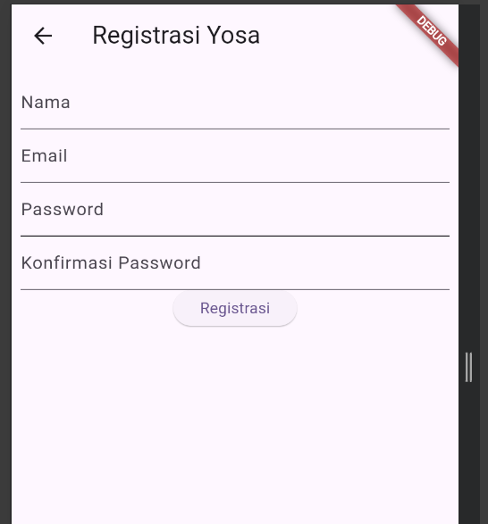
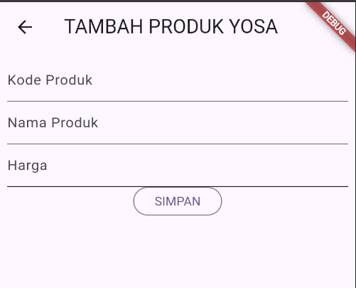
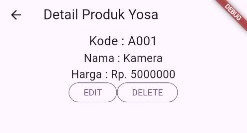
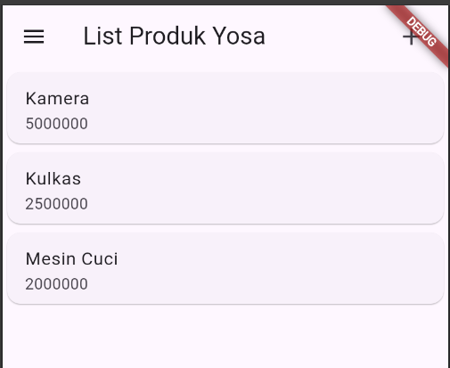

# tokokita
### 1. Halaman Registrasi (registrasi_page.dart)
File ini bertanggung jawab untuk menangani proses pendaftaran pengguna baru.

* **Tipe Widget:** Menggunakan StatefulWidget karena halaman ini memerlukan pengelolaan perubahan status pada form input.
* **Komponen Utama:**
    * **GlobalKey FormState:** Digunakan sebagai kunci unik untuk melakukan validasi pada seluruh kolom input sekaligus.
    * **TextEditingController:** Variabel pengendali untuk mengambil dan memanipulasi teks pada kolom Nama, Email, dan Password.
* **Logika Validasi:**
    * **Nama:** Wajib diisi dengan minimal 3 karakter.
    * **Email:** Menggunakan pola Regex untuk memastikan format email yang dimasukkan benar.
    * **Password:** Wajib diisi dengan minimal 6 karakter. Inputan disembunyikan menggunakan properti obscureText.
    * **Konfirmasi Password:** Melakukan pengecekan apakah input sama dengan kolom password utama.

### 2. Halaman Login (login_page.dart)
Halaman ini berfungsi sebagai pintu masuk pengguna ke dalam aplikasi.

* **Navigasi:** Terdapat teks "Registrasi" yang dibungkus dengan widget InkWell. Jika ditekan, pengguna akan diarahkan ke halaman Registrasi menggunakan Navigator.push.
* **Logika Input:**
    * Menggunakan struktur Form yang serupa dengan halaman registrasi.
    * Validasi yang diterapkan lebih sederhana, yaitu memastikan kolom email dan password tidak boleh kosong.
* **Tombol Login:** Menggunakan ElevatedButton yang memicu fungsi validasi form sebelum data diproses lebih lanjut.

### 3. Form Produk (produk_form.dart)
File ini dirancang agar dapat digunakan kembali (reusable) untuk dua fungsi sekaligus, yaitu Menambah Produk dan Mengubah Produk.

* **Logika Deteksi Mode:**
    * Logika ini berjalan pada fungsi initState.
    * Jika data produk tidak ada (null), maka halaman diatur ke mode Tambah Data.
    * Jika data produk tersedia, maka halaman beralih ke mode Ubah Data. Judul halaman berubah, dan kolom input otomatis terisi dengan data produk yang dikirimkan.
* **Input Data:** Menyediakan kolom untuk Kode Produk, Nama Produk, dan Harga (tipe input angka).
* **Tombol Submit:** Teks pada tombol akan menyesuaikan secara dinamis, menampilkan kata "SIMPAN" atau "UBAH" sesuai mode yang aktif.

### 4. Detail Produk (produk_detail.dart)
Halaman ini menyajikan informasi rinci mengenai satu produk tertentu yang dipilih dari daftar.

* **Tampilan Data:** Menampilkan atribut produk seperti Kode, Nama, dan Harga yang diterima dari parameter navigasi.
* **Aksi Pengguna:**
    * **Tombol Edit:** Membuka halaman produk_form.dart dengan membawa objek produk saat ini untuk diedit.
    * **Tombol Delete:** Menampilkan jendela dialog konfirmasi (AlertDialog) untuk memastikan pengguna benar-benar ingin menghapus data tersebut.

### 5. List Produk (produk_page.dart)
Halaman utama aplikasi yang menampilkan daftar seluruh produk.

* **Sumber Data:** Menggunakan data statis (Dummy Data) dalam bentuk List sebagai data sementara sebelum aplikasi terhubung ke API.
* **Komponen List:**
    * Daftar produk ditampilkan menggunakan widget ListView agar bisa digulir.
    * Setiap item produk direpresentasikan menggunakan widget Card dan ListTile agar tampilan terlihat rapi.
* **Interaksi:**
    * Setiap kartu produk memiliki properti onTap atau deteksi sentuhan.
    * Jika salah satu produk ditekan, aplikasi akan berpindah ke halaman Detail Produk sesuai dengan item yang dipilih.

## ss

### registrasi

### login

### from produk

### detail produk

### list produk
